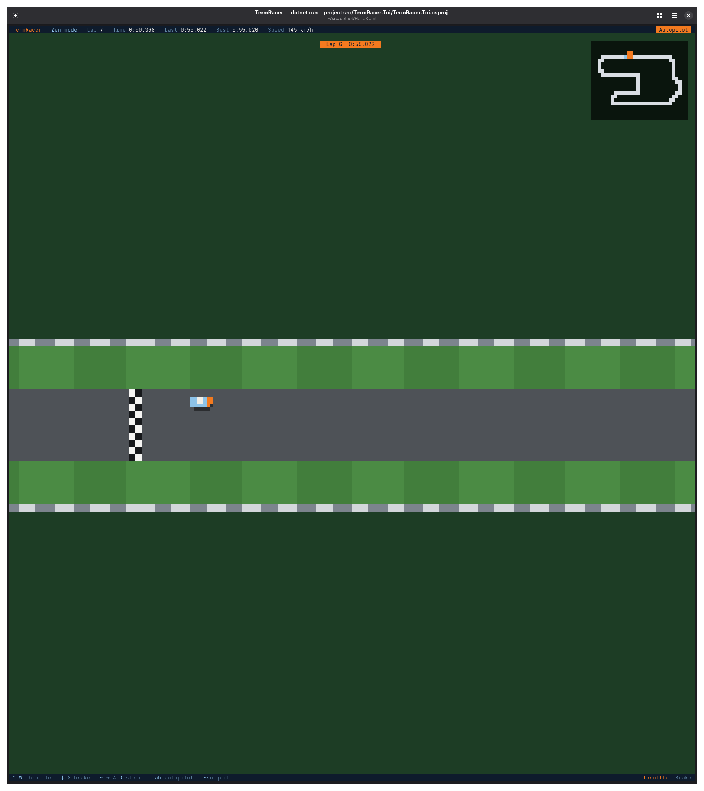

# TermRacer

Top-down racing in the terminal. One circuit, a timed lap or endless laps, an autopilot you can hand the car to at any moment and that gets faster every lap it drives, saved replays, and a ghost of the fastest lap to race against.

## Requirements

- A 24-bit colour terminal of at least 120 × 40 cells. Smaller windows get a resize prompt and the game waits.
- To build from source: .NET 10 SDK (any 10.0 feature band; see `global.json`).

## Install

Every push to `main` publishes a release with self-contained single-file builds for Linux, macOS and Windows on x64 and arm64, plus `SHA256SUMS.txt`. Download the archive for your platform, unpack it and run `termracer` (`termracer.exe` on Windows). No .NET install is needed.

macOS marks downloaded files as quarantined; clear that once with `xattr -d com.apple.quarantine termracer`.

`termracer --version` prints the version and exits.

## Run and test

```sh
dotnet run --project src/TermRacer.Tui
dotnet test
```

`dotnet test` runs the three xUnit v3 suites on Microsoft Testing Platform (enabled in `global.json`). Each test project is also a standalone executable, for example `dotnet run --project tests/TermRacer.Core.Tests`.

## Controls

| Key | Racing | Replay viewer |
| --- | --- | --- |
| ↑ or W | Throttle | Faster playback |
| ↓ or S | Brake; reverse when stopped | Slower playback |
| ← → or A D | Steer | Seek 5 s back or forward |
| Tab | Switch between manual driving and autopilot | |
| G | Show or hide the ghost | Show or hide the ghost |
| Enter or Space | | Pause; replay from the start at the end |
| Backspace | Back to the menu | Back to the replay list |
| Esc | Quit immediately | Quit immediately |

In menus, ↑ ↓ choose, Enter or Space confirms and Backspace goes back. Esc quits from anywhere without asking.

Terminals that report key releases through the kitty keyboard protocol (kitty, WezTerm, foot, Ghostty, Windows Terminal) get exact hold-to-drive controls. In other terminals the throttle stays on after one press until you brake, and steering lasts as long as key repeats keep arriving.

## Modes

- **Single lap**: one timed lap. The car starts just behind the line, the clock starts when you cross it, and the race ends when you cross it again with every checkpoint passed. The final time and how it compares with the record are shown until you press Enter or Esc.
- **Zen mode**: no lap limit. Current, last and best lap times are shown for reference. Leave with Backspace (back to the menu) or Esc (quit).
- **Replays**: every completed lap is saved with how it was driven: position, speed, throttle, brake and steering, and whether you or the autopilot had the wheel. Pick one from the list to watch it with the chase camera, scrub through it, change the speed, and compare it with the fastest lap's ghost.

## Ghost

While racing, a translucent car drives the fastest lap recorded so far, and the top bar shows the live gap to it (green when you are ahead, red when behind). A lap from a standing start (any first lap) is compared with the fastest standing lap; later laps in Zen mode are compared with the fastest flying lap. A new record becomes the ghost from the next lap on.

## Autopilot that learns

The autopilot keeps one speed factor per corner. After every lap it drives entirely on its own, each corner it took cleanly is tried a little faster next time, and a corner where it ran wide of its line, touched the grass or hit a wall is pulled back halfway towards the last speed that worked. When the autopilot feels the car running wide it lifts and brakes, so learning rarely costs much time. On Gullwing Park it starts at about 55.0 s a flying lap and settles near 51.4 s after a dozen or so laps. Laps you drive yourself, or share with it, are recorded but not used for training. The training is saved, so the autopilot keeps what it learned between sessions, and the menu shows its progress.

## Saved data

Lap times, replays and the autopilot's training are plain local files, nothing is sent anywhere. The folder is the first of:

1. `$TERMRACER_DATA_DIR`, if set.
2. A `termracer-data` folder next to the executable, if it exists (portable mode: create the folder to use it).
3. `$XDG_DATA_HOME/termracer`, if `XDG_DATA_HOME` is set to an absolute path.
4. `%LOCALAPPDATA%\TermRacer` on Windows, `~/.local/share/termracer` elsewhere.

The menu shows the folder in use. `laps.tsv` is a tab-separated text file with one row per completed lap, `replays/` holds the recorded laps, and `autopilot.tsv` the training. The fastest laps and the 20 most recent keep their replays; older replays are deleted, their rows in `laps.tsv` stay. See `docs/data-files.md` for the formats.

## Layout

```
TermRacer.slnx
global.json                    SDK roll-forward and MTP test runner
Directory.Build.props          shared compiler settings
Directory.Packages.props       central package versions
.github/workflows/ci.yml       build, test and format check on Linux, Windows and macOS
.github/workflows/release.yml  test, publish six targets and release on every push to main
.github/dependabot.yml         weekly updates for actions and packages
src/TermRacer.Core             simulation: track, physics, lap rules, autopilot and training, recording, game flow
src/TermRacer.Rendering        rasterizer, cell buffers, frame diff, scene and HUD
src/TermRacer.Storage          data folder, lap log, replay and training files
src/TermRacer.Tui              Terminal.Gui shell: input, timer, writing changed cells
tests/TermRacer.Core.Tests
tests/TermRacer.Rendering.Tests
tests/TermRacer.Storage.Tests
docs/architecture.md
docs/data-files.md
```

Only `TermRacer.Tui` references Terminal.Gui. See `docs/architecture.md` for how the pieces fit.

## Releases

`release.yml` runs on every push to `main`. It reuses `ci.yml` to build and test on all three operating systems, publishes self-contained single-file builds for `linux-x64`, `linux-arm64`, `osx-x64`, `osx-arm64`, `win-x64` and `win-arm64` (macOS builds are ad-hoc signed), and creates a full release tagged `v1.0.<run number>` with generated notes and checksums. A release is marked latest only if its commit is still the tip of `main`, so a slow run never takes that from a newer one. Change the `VERSION` line in `release.yml` to move to a new major or minor version. Local builds report `0.0.0-dev`.


